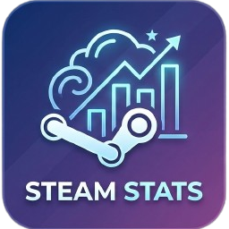
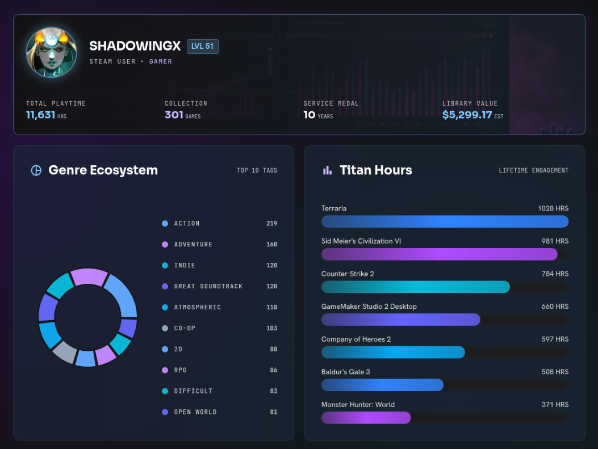

<div align="center">
  

  # Steam Stats

  [](https://www.java.com/)
  [](https://spring.io/projects/spring-boot)
  [](#)
  [](https://nextjs.org/)
  [](https://www.typescriptlang.org/)
  [](https://tailwindcss.com/)

</div>


## Sobre

**Steam Stats** é uma aplicação full-stack que transforma dados do seu perfil da Steam em visualizações interativas e análises detalhadas. Descubra estatísticas sobre sua biblioteca de jogos, horas jogadas, valor estimado da conta, distribuição de gêneros, e muito mais.

> **Comparação entre jogadores:** Compare dois perfis lado a lado e veja similaridades, jogos em comum, e afinidade por gêneros!

---
<div align="center">
  
</div>


## Funcionalidades

### Dashboard
- **Perfil completo:** Avatar, nome, nível Steam e idade da conta
- **Horas totais:** Soma de todas as horas jogadas na biblioteca
- **Valor estimado:** Cálculo do valor total da sua biblioteca com base em preços da Steam Store
- **Gêneros favoritos:** Gráfico de rosca (donut) e treemap com distribuição de tags/gêneros
- **Mais jogados:** Top jogos com barras de horas ("Titan Hours")
- **Atividade recente:** Jogos das últimas 2 semanas com gráfico de barras

### Biblioteca
- Lista completa de jogos ordenada por horas jogadas
- Campo de busca para filtrar jogos
- Scroll infinito com carregamento sob demanda
- Imagens dos jogos e barras de progresso de horas

### Comparações
- Jogos em comum entre dois perfis
- Similaridade de gêneros (cosseno) em porcentagem
- Gráfico radial (radar) de afinidade por tags
- Gráfico de barras lado a lado por gênero
- Comparação de horas nos jogos compartilhados

---

### APIs Externas
- [Steam Web API](https://steamcommunity.com/dev) -- Dados de perfil, jogos, nível
- [SteamSpy API](https://steamspy.com/) -- Tags e metadados dos jogos
- [Steam Store API](https://wiki.teamfortress.com/wiki/User:RJackson/StorefrontAPI) -- Preços e imagens

### Dataset de Seed
- [Steam Games Dataset (Kaggle)](https://www.kaggle.com/datasets/fronkongames/steam-games-dataset) -- Utilizado para popular o banco de dados com metadados iniciais (preços, tags, imagens), contornando as limitações de taxa (rate limits) das APIs externas.

---

## Como Rodar

### Pré-requisitos
- Java 25+
- Node.js 20+
- PostgreSQL
- Chave da [Steam Web API](https://steamcommunity.com/dev)

### Backend

```bash
# Configure o banco de dados e a API key
cp steam-stats-backend/steam-stats-backend/src/main/resources/application.properties.example \
   steam-stats-backend/steam-stats-backend/src/main/resources/application.properties
# Edite o arquivo com suas credenciais

# Execute com Maven
cd steam-stats-backend/steam-stats-backend
./mvnw spring-boot:run
```

O backend será iniciado em `http://localhost:8080`.

### Frontend

```bash
cd steam-stats-front
npm install
npm run dev
```

O frontend será iniciado em `http://localhost:3000`.

---

## Licença

Distribuído sob a licença MIT.
